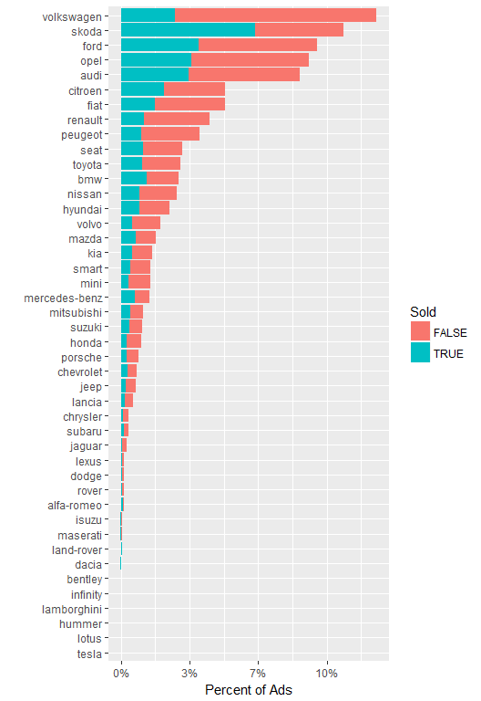

Classified Ads for Cars Dataset Analysis
================

``` r
set.seed(42)
library(ggplot2)
library(reshape2)
library(plyr)
library(readr)
library(fpc)
library(data.table)
library(ggplot2)
```

## Connecting to USED\_CARS database in HIVE running on Hortonworks Sandbox VM

    options( java.parameters = "-Xmx8g" )
    library(rJava)
    library(RJDBC)
     
    cp = c("//d:/tools/apache-hive-1.2.2/lib/hive-jdbc-1.2.2-standalone.jar",
           "//d:/tools/hadoop-2.7.7/share/hadoop/common/hadoop-common-2.7.7.jar")
    .jinit(classpath=cp) 
     
    drv <- JDBC(driverClass = "org.apache.hive.jdbc.HiveDriver",
                classPath = "//d:/tools/apache-hive-1.2.2/lib/hive-jdbc-1.2.2-standalone.jar",
                 identifier.quote="`")
     
    conn <- dbConnect(drv, "jdbc:hive2://127.0.0.1:10000/used_cars", "maria_dev", "maria_dev")

## Discover the USED\_CARS database

First we are getting the EVENTS table description. Full description of
the attributes presented on [Classified Ads for
Cars](https://www.kaggle.com/mirosval/personal-cars-classifieds/home)
home page.

``` r
descr <- dbGetQuery(conn, "describe events")
kable(descr)
```

| col\_name            | data\_type    | comment |
| :------------------- | :------------ | :------ |
| maker                | string        |         |
| model                | string        |         |
| mileage              | int           |         |
| manufacture\_year    | int           |         |
| engine\_displacement | int           |         |
| engine\_power        | int           |         |
| body\_type           | string        |         |
| color\_slug          | string        |         |
| stk\_year            | string        |         |
| transmission         | string        |         |
| door\_count          | int           |         |
| seat\_count          | int           |         |
| fuel\_type           | string        |         |
| date\_created        | timestamp     |         |
| date\_last\_seen     | timestamp     |         |
| price\_eur           | decimal(13,2) |         |

Code below selecting first 10 rows for EVENTS table and saves them to
‘cars’ dataframe. Note that we rename cars columns for better
presentation. Also note that it looks that the dataset has some missing
values.

``` r
cars <- dbGetQuery(conn, "select * from events limit 6")
colnames(cars) <- c(
  "Maker", "Model","Mileage","Year", "Disp", "Pwr", "Body", "Color", "Sticker", 
  "Trans", "Doors", "Seats", "Fuel", "Listed", "Removed", "Price")
```

``` r
kable(cars)
```

| Maker | Model   | Mileage | Year | Disp | Pwr | Body | Color | Sticker | Trans | Doors | Seats | Fuel     | Listed                  | Removed                 |    Price |
| :---- | :------ | ------: | ---: | ---: | --: | :--- | :---- | :------ | :---- | ----: | ----: | :------- | :---------------------- | :---------------------- | -------: |
| ford  | galaxy  |  151000 | 2011 | 2000 | 103 |      |       | None    | man   |     5 |     7 | diesel   | 2015-11-14 18:10:06.838 | 2016-01-27 20:40:15.463 | 10584.75 |
| skoda | octavia |  143476 | 2012 | 2000 |  81 |      |       | None    | man   |     5 |     5 | diesel   | 2015-11-14 18:10:06.853 | 2016-01-27 20:40:15.463 |  8882.31 |
| bmw   |         |   97676 | 2010 | 1995 |  85 |      |       | None    | man   |     5 |     5 | diesel   | 2015-11-14 18:10:06.861 | 2016-01-27 20:40:15.463 | 12065.06 |
| skoda | fabia   |  111970 | 2004 | 1200 |  47 |      |       | None    | man   |     5 |     5 | gasoline | 2015-11-14 18:10:06.872 | 2016-01-27 20:40:15.463 |  2960.77 |
| skoda | fabia   |  128886 | 2004 | 1200 |  47 |      |       | None    | man   |     5 |     5 | gasoline | 2015-11-14 18:10:06.88  | 2016-01-27 20:40:15.463 |  2738.71 |
| skoda | fabia   |  140932 | 2003 | 1200 |  40 |      |       | None    | man   |     5 |     5 | gasoline | 2015-11-14 18:10:06.894 | 2016-01-27 20:40:15.463 |  1628.42 |

The EVENTS table has 3,552,912 records which could be confirmed by
running the HQL statement below.

    dbGetQuery(conn, "select count (*) from events")

For the analysis we will extract not more than 20K rows from EVENT table
randomly using the HQL statement below. We skip the rows mising one of
the folloowing important attributes: maker, model, mileage,
manufacture\_year or price\_eur. As we can see, we had only 11431
samples complying to this condition:

``` r
lim <- 20000/3552912

sample_HQL <- paste(
  "select * from events",
    " WHERE",
      " rand(123) <= ", lim,
      " AND maker <> '' AND model <> '' AND mileage is not NULL AND manufacture_year is not NULL",
      " AND price_eur is not NULL",
  " limit 20000"
) 

cars.sample <- dbGetQuery(conn, sample_HQL)
colnames(cars.sample) <- c(
  "Maker", "Model","Mileage","Year", "Disp", "Pwr", "Body", "Color", "Sticker", 
  "Trans", "Doors", "Seats", "Fuel", "Listed", "Removed", "Price")

nrow(cars.sample)
```

    ## [1] 11431

``` r
kable(head(cars.sample))
```

| Maker   | Model    | Mileage | Year | Disp | Pwr | Body | Color | Sticker | Trans | Doors | Seats | Fuel   | Listed                  | Removed                 |    Price |
| :------ | :------- | ------: | ---: | ---: | --: | :--- | :---- | :------ | :---- | ----: | ----: | :----- | :---------------------- | :---------------------- | -------: |
| nissan  | qashqai  |   44450 | 2010 | 2000 | 110 |      |       | None    | man   |     5 |     5 | diesel | 2015-11-14 18:54:14.758 | 2016-01-27 20:40:15.463 | 13693.56 |
| ford    | mondeo   |  159217 | 2005 | 1998 |  96 |      |       | None    | man   |     5 |     5 | diesel | 2015-11-14 18:55:26.371 | 2016-01-27 20:40:15.463 |  3252.70 |
| volvo   | v40      |   18755 | 2013 | 1560 |  84 |      |       | None    | man   |     5 |     5 | diesel | 2015-11-14 18:55:27.402 | 2016-01-27 20:40:15.463 | 19059.96 |
| citroen | berlingo |    5000 | 2015 | 1560 |  88 |      |       | None    | man   |    NA |    NA | diesel | 2015-11-14 18:55:33.292 | 2016-01-27 20:40:15.463 | 14776.09 |
| skoda   | octavia  |   14251 | 2014 | 1598 |  77 |      |       | None    | man   |     5 |     5 | diesel | 2015-11-14 18:55:37.782 | 2016-01-27 20:40:15.463 | 17760.92 |
| skoda   | superb   |  175159 | 2011 | 2000 | 103 |      |       | None    | auto  |     5 |     5 | diesel | 2015-11-14 18:55:41.427 | 2016-01-27 20:40:15.463 | 14433.75 |

``` r
summary(cars.sample)
```

    ##     Maker              Model              Mileage             Year     
    ##  Length:11431       Length:11431       Min.   :      0   Min.   :   0  
    ##  Class :character   Class :character   1st Qu.:  26116   1st Qu.:2005  
    ##  Mode  :character   Mode  :character   Median :  94220   Median :2010  
    ##                                        Mean   : 121082   Mean   :2003  
    ##                                        3rd Qu.: 159226   3rd Qu.:2014  
    ##                                        Max.   :9257655   Max.   :2017  
    ##                                                                        
    ##       Disp            Pwr             Body              Color          
    ##  Min.   :   13   Min.   : 10.00   Length:11431       Length:11431      
    ##  1st Qu.: 1390   1st Qu.: 66.00   Class :character   Class :character  
    ##  Median : 1598   Median : 81.00   Mode  :character   Mode  :character  
    ##  Mean   : 1878   Mean   : 92.23                                        
    ##  3rd Qu.: 1984   3rd Qu.:105.00                                        
    ##  Max.   :32000   Max.   :558.00                                        
    ##  NA's   :1836    NA's   :1119                                          
    ##    Sticker             Trans               Doors           Seats       
    ##  Length:11431       Length:11431       Min.   :0.000   Min.   : 0.000  
    ##  Class :character   Class :character   1st Qu.:4.000   1st Qu.: 5.000  
    ##  Mode  :character   Mode  :character   Median :4.000   Median : 5.000  
    ##                                        Mean   :4.114   Mean   : 4.892  
    ##                                        3rd Qu.:5.000   3rd Qu.: 5.000  
    ##                                        Max.   :6.000   Max.   :55.000  
    ##                                        NA's   :2695    NA's   :3307    
    ##      Fuel              Listed            Removed              Price       
    ##  Length:11431       Length:11431       Length:11431       Min.   :     0  
    ##  Class :character   Class :character   Class :character   1st Qu.:  1295  
    ##  Mode  :character   Mode  :character   Mode  :character   Median :  6891  
    ##                                                           Mean   : 10117  
    ##                                                           3rd Qu.: 14350  
    ##                                                           Max.   :781863  
    ## 

``` r
require(forcats)
total <- nrow(cars.sample)
ggplot(cars.sample, aes(fct_rev(fct_infreq(Maker)))) +
       geom_bar() + 
       geom_text(stat = "count", aes(label = ..count.., y = ..count..), nudge_y = 75)+
#       theme(axis.text.x = element_text(angle =90 , hjust = 1, vjust = 0.5)) +
       labs(x="", y="Percent of Ads in the Sample Set") +
#       scale_y_log10(breaks = c(1, 2, 5, 10, 25, 50, 100, 250, 500, 1000)) +
        scale_y_continuous(labels = function(x) sprintf("%.2f%%",x/total*100)) +
       coord_flip()
```



## Disconnecting from the HIVE

It is very important to disconnect from the HIVE at the end of the
session:

``` r
dbDisconnect(conn)
```

    ## [1] TRUE
