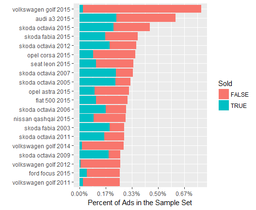

Classified Ads for Cars Dataset Analysis
================

``` r
set.seed(42)
library(ggplot2)
library(reshape2)
library(plyr)
library(readr)
library(fpc)
library(data.table)
library(ggplot2)
```

## Connecting to USED\_CARS database in HIVE running on Hortonworks Sandbox VM

    options( java.parameters = "-Xmx8g" )
    library(rJava)
    library(RJDBC)
     
    cp = c("//d:/tools/apache-hive-1.2.2/lib/hive-jdbc-1.2.2-standalone.jar",
           "//d:/tools/hadoop-2.7.7/share/hadoop/common/hadoop-common-2.7.7.jar")
    .jinit(classpath=cp) 
     
    drv <- JDBC(driverClass = "org.apache.hive.jdbc.HiveDriver",
                classPath = "//d:/tools/apache-hive-1.2.2/lib/hive-jdbc-1.2.2-standalone.jar",
                 identifier.quote="`")
     
    conn <- dbConnect(drv, "jdbc:hive2://127.0.0.1:10000/used_cars", "maria_dev", "maria_dev")

## Discover the USED\_CARS database

First we are getting the EVENTS table description. Full description of
the attributes presented on [Classified Ads for
Cars](https://www.kaggle.com/mirosval/personal-cars-classifieds/home)
home page.

``` r
descr <- dbGetQuery(conn, "describe events")
kable(descr)
```

| col\_name            | data\_type    | comment |
| :------------------- | :------------ | :------ |
| maker                | string        |         |
| model                | string        |         |
| mileage              | int           |         |
| manufacture\_year    | int           |         |
| engine\_displacement | int           |         |
| engine\_power        | int           |         |
| body\_type           | string        |         |
| color\_slug          | string        |         |
| stk\_year            | string        |         |
| transmission         | string        |         |
| door\_count          | int           |         |
| seat\_count          | int           |         |
| fuel\_type           | string        |         |
| date\_created        | timestamp     |         |
| date\_last\_seen     | timestamp     |         |
| price\_eur           | decimal(13,2) |         |

Code below selecting first 10 rows for EVENTS table and saves them to
‘cars’ dataframe. Note that we rename cars columns for better
presentation. Also note that it looks that the dataset has some missing
values.

``` r
cars <- dbGetQuery(conn, "select * from events limit 6")
colnames(cars) <- c(
  "Maker", "Model","Mileage","Year", "Disp", "Pwr", "Body", "Color", "Sticker", 
  "Trans", "Doors", "Seats", "Fuel", "Listed", "Removed", "Price")
```

``` r
kable(cars)
```

| Maker | Model   | Mileage | Year | Disp | Pwr | Body | Color | Sticker | Trans | Doors | Seats | Fuel     | Listed                  | Removed                 |    Price |
| :---- | :------ | ------: | ---: | ---: | --: | :--- | :---- | :------ | :---- | ----: | ----: | :------- | :---------------------- | :---------------------- | -------: |
| ford  | galaxy  |  151000 | 2011 | 2000 | 103 |      |       | None    | man   |     5 |     7 | diesel   | 2015-11-14 18:10:06.838 | 2016-01-27 20:40:15.463 | 10584.75 |
| skoda | octavia |  143476 | 2012 | 2000 |  81 |      |       | None    | man   |     5 |     5 | diesel   | 2015-11-14 18:10:06.853 | 2016-01-27 20:40:15.463 |  8882.31 |
| bmw   |         |   97676 | 2010 | 1995 |  85 |      |       | None    | man   |     5 |     5 | diesel   | 2015-11-14 18:10:06.861 | 2016-01-27 20:40:15.463 | 12065.06 |
| skoda | fabia   |  111970 | 2004 | 1200 |  47 |      |       | None    | man   |     5 |     5 | gasoline | 2015-11-14 18:10:06.872 | 2016-01-27 20:40:15.463 |  2960.77 |
| skoda | fabia   |  128886 | 2004 | 1200 |  47 |      |       | None    | man   |     5 |     5 | gasoline | 2015-11-14 18:10:06.88  | 2016-01-27 20:40:15.463 |  2738.71 |
| skoda | fabia   |  140932 | 2003 | 1200 |  40 |      |       | None    | man   |     5 |     5 | gasoline | 2015-11-14 18:10:06.894 | 2016-01-27 20:40:15.463 |  1628.42 |

The EVENTS table has 3,552,912 records which could be confirmed by
running the HQL statement below.

    dbGetQuery(conn, "select count (*) from events")

For the analysis we will extract not more than 30K rows from EVENT table
randomly using the HQL statement below. We skip the rows mising the most
important attributes:

``` r
filter <- paste(
      " maker <> ''",
      " AND model <> ''",
      " AND mileage is not NULL",
      " AND manufacture_year is not NULL",
      " AND price_eur is not NULL"
) 
count <- dbGetQuery(conn, paste("select count(*) from events", " WHERE", filter))
cars.sample.totalFilered <- count$`_c0`
```

``` r
car.sample.maxSize <- 30000
lim <- car.sample.maxSize/cars.sample.totalFilered

sample_HQL <- paste(
  "select * from events WHERE", filter,
      " AND rand(123) < ", lim,
  " limit ", 1.2 * car.sample.maxSize
) 

cars.sample <- dbGetQuery(conn, sample_HQL)
colnames(cars.sample) <- c(
  "Maker", "Model","Mileage","Year", "Disp", "Pwr", "Body", "Color", "Sticker", 
  "Trans", "Doors", "Seats", "Fuel", "Listed", "Removed", "Price")

nrow(cars.sample)
```

    ## [1] 29958

``` r
kable(head(cars.sample))
```

| Maker | Model    | Mileage | Year | Disp | Pwr | Body | Color | Sticker | Trans | Doors | Seats | Fuel     | Listed                  | Removed                 |   Price |
| :---- | :------- | ------: | ---: | ---: | --: | :--- | :---- | :------ | :---- | ----: | ----: | :------- | :---------------------- | :---------------------- | ------: |
| skoda | citigo   |   10349 | 2014 | 1000 |  44 |      |       | None    | auto  |     5 |     4 | gasoline | 2015-11-14 18:54:16.065 | 2016-01-27 20:40:15.463 | 8142.12 |
| fiat  | marea    |  300017 | 2000 | 1581 |  76 |      |       | None    | man   |     5 |     5 | gasoline | 2015-11-14 18:55:23.485 | 2016-01-27 20:40:15.463 |  736.49 |
| skoda | octavia  |  145665 | 2003 | 1595 |  75 |      |       | None    | man   |     5 |     5 | gasoline | 2015-11-14 18:55:29.401 | 2016-01-27 20:40:15.463 | 4276.65 |
| skoda | citigo   |    9800 | 2015 |  999 |  44 |      |       | None    | man   |     5 |     4 | gasoline | 2015-11-14 18:55:33.465 | 2016-01-27 20:40:15.463 | 7768.32 |
| kia   | sportage |       1 | 2001 | 1998 |  61 |      |       | None    | man   |     5 |     5 | diesel   | 2015-11-14 18:55:35.467 | 2016-01-27 20:40:15.463 | 1813.47 |
| skoda | superb   |  234000 | 2002 | 1900 |  96 |      |       | None    |       |     4 |     5 | diesel   | 2015-11-14 18:55:35.74  | 2016-01-27 20:40:15.463 | 3293.86 |

``` r
# summary(cars.sample)
```

What is the best selling car maker?

``` r
require(forcats)
total <- nrow(cars.sample)
ggplot(cars.sample, aes(fct_rev(fct_infreq(Maker)))) +
       geom_bar() + 
       geom_text(stat = "count", aes(label = ..count.., y = ..count..), nudge_y = 200)+
       labs(x="", y="Percent of Ads in the Sample Set") +
        scale_y_continuous(labels = function(x) sprintf("%.0f%%",x/total*100)) +
       coord_flip()
```


What is the best selling car model?

``` r
require(forcats)
total <- nrow(cars.sample)
cars.sample$Car <- paste(cars.sample$Maker, cars.sample$Model)
betsCarsList <- fct_infreq(cars.sample$Car)
cars.sample.bestCars <- cars.sample[cars.sample$Car %in%  levels(betsCarsList)[1:40],]
ggplot(cars.sample.bestCars, aes(fct_rev(fct_infreq(Car)))) +
       geom_bar() + 
       geom_text(stat = "count", aes(label = ..count.., y = ..count..), nudge_y = 75)+
       labs(x="", y="Percent of Ads in the Sample Set") +
       scale_y_continuous(labels = function(x) sprintf("%.0f%%",x/total*100)) + 
      coord_flip()
```


What is the best selling car?

``` r
require(forcats)
total <- nrow(cars.sample)
cars.sample$Car1 <- paste(cars.sample$Maker, cars.sample$Model, cars.sample$Year)
betsCarsList <- fct_infreq(cars.sample$Car1)
cars.sample.bestCars <- cars.sample[cars.sample$Car1 %in%  levels(betsCarsList)[1:20],]
ggplot(cars.sample.bestCars, aes(fct_rev(fct_infreq(Car1)))) +
       geom_bar() + 
       geom_text(stat = "count", aes(label = ..count.., y = ..count..), nudge_y = 10)+
       labs(x="", y="Percent of Ads in the Sample Set") +
       scale_y_continuous(labels = function(x) sprintf("%.2f%%",x/total*100)) + 
      coord_flip()
```



## Disconnecting from the HIVE

It is very important to disconnect from the HIVE at the end of the
session:

``` r
dbDisconnect(conn)
```

    ## [1] TRUE
